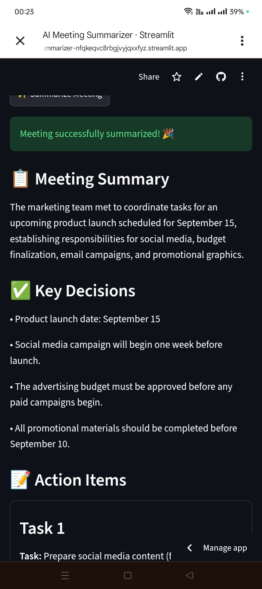

# 🤖 AI Meeting Summarizer

An AI-powered meeting assistant that transforms meeting transcripts or notes into structured summaries, decisions, and actionable tasks.

## 🚀 Project Overview

The AI Meeting Summarizer helps teams turn lengthy meeting notes or transcripts into concise, organized information.

Users provide meeting notes or a transcript, and the application uses Google Gemini to automatically generate:

* Meeting summary
* Key decisions
* Action items
* Important discussion points

The application also allows users to download the generated results for later use.

## 🔄 Workflow

```text
Meeting Notes / Transcript
          ↓
      Streamlit App
          ↓
     Google Gemini
          ↓
     AI Processing
          ↓
   ┌──────┼─────────┐
   ↓      ↓         ↓
Summary  Decisions  Action Items
          ↓
     Display Results
          ↓
     Download Results
```

## ✨ Features

### 📝 Meeting Input

Users can enter meeting notes or transcripts directly into the application.

### 🤖 AI Summarization

Google Gemini analyzes the meeting content and generates a concise summary.

### 🎯 Decision Extraction

The application identifies important decisions made during the meeting.

### ✅ Action Items

The AI extracts tasks and responsibilities that need to be completed after the meeting.

### 📥 Downloadable Results

Users can download the generated meeting summary and action items for future reference.

### 📊 Structured Output

Meeting information is organized into clear sections, making it easier to review and share.

## 🧪 Example

### Input

```text
The marketing team discussed the launch of the new campaign.

Sarah will prepare the social media content by Friday.

John will finalize the advertising budget.

The team agreed that the campaign will launch on Monday.
```

### AI Output

**Summary**

The marketing team discussed the upcoming campaign launch and assigned responsibilities for content creation and budgeting.

**Decisions**

* Campaign launch date: Monday

**Action Items**

* Sarah → Prepare social media content by Friday
* John → Finalize advertising budget
## 📸 Application Screenshot


## 🛠️ Technologies

* Python
* Streamlit
* Google Gemini API
* Pandas
* GitHub

## 🔐 Security

API credentials are stored securely using Streamlit secrets and are not included directly in the source code.

## 📁 Project Structure

```text
AI-Meeting-Summarizer/
│
├── streamlit_app.py
├── requirements.txt
└── README.md
```

## ⚙️ How It Works

### 1. User Provides Meeting Content

The user enters meeting notes or a transcript into the Streamlit application.

### 2. Gemini Processes the Content

The application sends the meeting content to Google Gemini with instructions to identify the most important information.

### 3. AI Generates Structured Results

Gemini produces:

* Summary
* Key decisions
* Action items

### 4. Results Are Displayed

The application presents the results in an easy-to-read format.

### 5. Results Can Be Downloaded

Users can download the generated meeting information for future use.

## 🎯 Business Value

Meetings often produce large amounts of information that can be difficult to organize and remember.

This application demonstrates how generative AI can automate meeting documentation and reduce the amount of manual work required after meetings.

Instead of manually reviewing an entire transcript, users can quickly obtain the important information they need.

## 🔮 Future Improvements

Possible improvements include:

* Automatic Google Docs integration
* Notion integration
* Gmail delivery of meeting summaries
* Calendar integration
* Automatic transcript processing
* Speaker identification
* Meeting sentiment analysis
* Automatic task assignment
* Slack notifications
## 🚀 Live Demo

[Try the AI Meeting Summarizer](https://ai-meeting-summarizer-nfqkeqvc8rbgjvyjqxxfyz.streamlit.app/)

## 👩🏽‍💻 Author

**Caroline Maina**

AI Automation & Generative AI Projects

GitHub: `carolinemainaprojects`
LinkedIn: Caroline Maina
```
```
# AI-Meeting-Summarizer
AI-powered meeting summarization and action-item extraction
